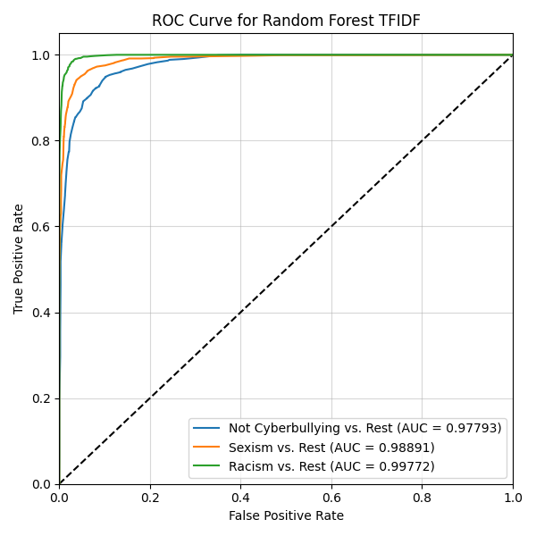

# daquin-language-evolution

This is Christopher Denq's submission for Prof. Daquin's GSoC 2024: Examination of the evolution of language among Dark Web users.

**Christopher Denq** (they/he) is a mathematics/philosophy sophomore at the University of Illinois Springfield. They are interested in the on-scale ethical applications of AI/NLP and interpretability within legal and regulatory spaces.

# Executive Summary
This project demonstrates a "proof-of-concept" starting point for a **multi-class** classifier, which determines whether Twitter tweets are (1) not cyberbullying, (2) sexist, or (3) racist. By using using a random forest model for my multi-class classifier, I was able to achieve the following performance metrics on validation score:
- AUC
    - not cyberbullying: 0.978
    - sexism: 0.989
    - racism: 0.997
- F1-scores
    - not cyberbullying: 0.89 
    - sexism: 0.92
    - racism: 0.97
- accuracy
    - overall 0.93

In general, this means that this model is able to predict the class correctly 93% of the time and (for example) able to differentiate a case of "not cyberbullying" from other classes 97% of the time. Because this model uses SMOTE for sampling, a naive guesser in this case would only get it right 33% of the time (in case of accuracy) and 50% of the time (in case of AUC score). This suggests that the model performs very well over a baseline comparator.

This project offers a modular and flexible starting point for future work. Explanations and conclusion analyses are included in my `.ipynb` notebooks, along with suggestions at pertinent points during the workflow for future suggestions.



# Getting started

Clone repo
```sh
git clone https://github.com/cdenq/daquin-language-evolution.git
```

Setup virtual environment
```sh
conda create --name cyberbullying_classifier
source activate cyberbullying_classifier
pip install -r requirements.txt
```

Navigate to main folder
```sh
cd daquin-language-evolution/dev
ls
```

There will be two files within the `dev` folder: `eda.ipynb` and `model.ipynb`. **These two files are the "primary submissions" for the technical assessment.**

# Navigation

See the file directory for an overview of the folder content. 
```bash
daquin-language-evolution
├── data
│   ├── prepped             # contains any generated/prepped data
│   │   └── *.csv
│   └── raw                 # contains the raw data downloaded from the test database
│       └── *.csv
├── dev
│   ├── eda.ipynb           # code used for basic data cleaning
│   └── model.ipynb         # code used for data pre-processing (NLP) and modeling
├── modules
│   ├── __init__.py         # used for backend imports
│   ├── eda.py              # helper code for EDA
│   ├── evaluate.py         # helper code for modeling
│   ├── helper.py           # helper code for general programming
│   └── imports.py          # code for imports & global+default variables 
├── outputs
│   ├── eda_outputs         # contains EDA visualizations and files
│   │   └── *.csv
│   ├── model_outputs       # contains modeling visualizations and files
│   │   └── *.csv
│   └── saved_models        # contains saved models
│       └── *.pkl
├── repo_assets
│   └── header.jpg          # the README's header image
├── .gitignore
├── LICENSE
├── README.md
└── requirements.txt
```